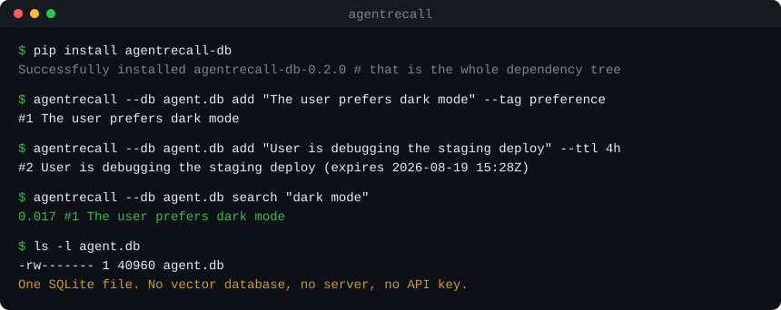

# agentrecall

[](https://pypi.org/project/agentrecall-db/)
[](https://pypi.org/project/agentrecall-db/)
[](LICENSE)

**Agent memory in a single SQLite file.** No vector database, no server, no cloud, no API key.

```bash
pip install agentrecall-db
```

> Installs as **`agentrecall-db`** on PyPI (the bare `agentrecall` name was taken). You
> still `import agentrecall` and run the `agentrecall` CLI — only the install name differs.

```python
from agentrecall import Memory

with Memory("agent.db") as mem:                      # one SQLite file, nothing else running
    mem.add("The user prefers dark mode", tags=["preference"])
    mem.add("User's name is Aziz; lives in Tashkent", metadata={"kind": "fact"})

    # The core install gives you fast keyword recall (SQLite FTS5). For meaning-based
    # search that matches paraphrases, add the [semantic] extra — see below.
    for hit in mem.search("dark mode preference", k=3):
        print(hit.score, hit.content)
```

That's the whole setup. `agent.db` is an ordinary SQLite file you can `cp`, `git diff`,
back up, inspect with any SQLite tool, and read from any language. Nothing else is running.

<p align="center">
  
</p>

---

## Why another memory library?

Most "memory layers" for agents are **infrastructure**. To get started you stand up a
vector database, run a server, sign up for a cloud, or hand over an API key — and many of
them call an LLM on every write to "extract" facts, which is slow, costs tokens, and is
non-deterministic.

`agentrecall` is the opposite. It is a **library**, the store is **one file**, recall is
**deterministic**, and **nothing leaves the machine**.

| | infra needed | semantic search | offline | stores | LLM call per write |
|---|---|---|---|---|---|
| **agentrecall** | **none** (1 file) | ✅ torch-free, opt-in | ✅ | SQLite | ❌ verbatim |
| mem0 | vector DB / cloud | ✅ | ⚠️ | vector + KV + graph | ✅ |
| Letta / MemGPT | server + Postgres | ✅ | ⚠️ | Postgres + pgvector | ✅ |
| Zep | server + datastore | ✅ | ⚠️ | knowledge graph | ✅ |
| official MCP memory server | none | ❌ keyword only | ✅ | JSONL flat file | ❌ |

Three things `agentrecall` does that nothing else combines:

1. **Zero infrastructure.** The core has **no third-party dependencies** — keyword recall
   runs on Python's stdlib `sqlite3` (FTS5 + BM25). A fresh `pip install agentrecall-db` with
   nothing else works.
2. **Semantic search with no torch, no GPU, no download server.** Add the `[semantic]`
   extra and you get hybrid keyword + vector recall powered by
   [model2vec](https://github.com/MinishLab/model2vec) static embeddings (~10 MB, CPU-only)
   stored in [sqlite-vec](https://github.com/asg017/sqlite-vec). Still one file, still offline.
3. **Verbatim & deterministic.** `agentrecall` never calls an LLM to mutate your memories.
   What you `add()` is what is stored — no silent fact-extraction, no cloud round-trip, no
   surprise token bills.

---

## Install

```bash
pip install agentrecall-db                 # core: keyword recall, stdlib only
pip install "agentrecall-db[semantic]"     # + torch-free semantic search (model2vec + sqlite-vec)
pip install "agentrecall-db[mcp]"          # + MCP server
pip install "agentrecall-db[all]"          # everything
```

## Semantic search (optional, torch-free)

```python
from agentrecall import Memory

# embeddings="auto" (the default) turns semantic on automatically *iff* the
# [semantic] extra is installed, and silently stays keyword-only otherwise.
mem = Memory("agent.db", embeddings="auto")
print(mem.semantic_enabled)   # True once you've installed agentrecall[semantic]

mem.add("I love hiking in the mountains on weekends")
hits = mem.search("outdoor hobbies")     # matches even with zero shared keywords
```

Search is **hybrid**: keyword (FTS5/BM25) and vector (cosine) candidates are blended with
[Reciprocal Rank Fusion](https://learn.microsoft.com/azure/search/hybrid-search-ranking),
so you get the precision of keywords and the recall of embeddings. Bring your own embedder
(OpenAI, a local model, anything) by passing `embedder=` — any object with `.dim` and
`.embed(texts) -> list[list[float]]`.

Optional ranking boosts:

```python
mem = Memory("agent.db", recency_weight=0.5, importance_weight=0.3)
mem.add("Critical: API key rotates on the 1st", importance=3.0)
mem.search("api key", recency_weight=1.0)   # per-call override
```

## Expiring memories (TTL)

Not every fact is true forever. A memory added with a `ttl` stops being recalled once its
deadline passes — no cron job, no cleanup pass, no `if` in your agent loop:

```python
mem.add("User is debugging the staging deploy", ttl="4h")   # gone after the session
mem.add("Rate limit resets at 14:00 UTC", ttl="1h")
mem.add("User's name is Aziz", )                            # no ttl → permanent
```

`ttl` accepts `"30d"`, `"12h"`, `"1h30m"`, a number of seconds, or a `timedelta`. For an
absolute deadline, pass `expires_at=<datetime>` instead (the two are mutually exclusive).

Expiry is a **visibility** rule, applied in SQL before the `LIMIT`, so an expired memory
never occupies a slot in your top-`k`:

```python
mem.search("staging")          # expired memories are absent
mem.all()                      # absent
mem.get(memory_id)             # raises MemoryNotFound
mem.count()                    # doesn't count them

mem.search("staging", include_expired=True)   # opt back in, on any read
```

Nothing is deleted until you say so. Rows linger — invisible — until you reclaim the disk:

```python
mem.purge_expired()            # returns how many rows went
```

Because it only removes what's already invisible, running it (or never running it) cannot
change what your agent recalls. To renew or cancel a deadline:

```python
mem.update(mid, ttl="7d")          # restart the countdown from now
mem.update(mid, expires_at=None)   # drop the deadline — permanent again
```

`update()` finds already-expired memories, so a renewal brings one back.

## Namespaces

Isolate memories per user, per agent, or per session with a namespace:

```python
alice = Memory("app.db", namespace="user:alice")
bob   = Memory("app.db", namespace="user:bob")     # same file, isolated memories
alice.add("prefers metric units")
bob.search("units")          # never sees Alice's memories
```

## As an MCP server

Give Claude (or any MCP client) persistent, searchable memory — an embeddings-capable
alternative to the official keyword-only JSONL memory server:

```bash
pip install "agentrecall-db[mcp]"
agentrecall serve --db ~/.agent-memory.db
```

```jsonc
// Claude Desktop / Claude Code MCP config
{
  "mcpServers": {
    "memory": {
      "command": "agentrecall",
      "args": ["serve", "--db", "/Users/me/.agent-memory.db"]
    }
  }
}
```

Tools exposed: `remember`, `recall`, `forget`, `forget_expired`, `list_memories`,
`memory_stats`. `remember` takes an optional `ttl`, so the model can mark a fact as
session-scoped when it stores it.

## CLI

```bash
agentrecall add "Deadline is July 7" --tags project --importance 2
agentrecall add "Debugging staging today" --ttl 4h    # expires on its own
agentrecall search "when is the deadline" -k 3
agentrecall list --limit 10 --include-expired
agentrecall stats                                     # live count + how many expired
agentrecall forget --keep-last 1000        # prune to the newest 1000 per namespace
agentrecall forget --expired               # reclaim disk from elapsed TTLs
agentrecall export --format md > memories.md
```

Move a store between machines with the JSON round-trip (`-` reads stdin):

```bash
agentrecall --db old.db export > memories.json
agentrecall --db new.db import memories.json
```

Import accepts either a JSON array or one object per line (JSONL), and preserves tags,
metadata, importance, namespace, and expiry. Ids are reassigned by the destination.

Every command honours `--db`, `--namespace`, and the `AGENTRECALL_DB` /
`AGENTRECALL_NAMESPACE` / `AGENTRECALL_EMBEDDINGS` environment variables.

## API at a glance

```python
mem.add(content, *, tags=None, metadata=None, importance=1.0, namespace=None,
        ttl=None, expires_at=None)                                           -> MemoryRecord
mem.add_many([str | dict, ...])                                              -> list[MemoryRecord]
mem.search(query, *, k=5, namespace=None, tags=None, recency_weight=None,
           importance_weight=None, include_expired=False)                    -> list[MemoryHit]
mem.get(id, *, include_expired=False) / mem.update(id, ...) / mem.delete(id)
mem.all(*, namespace=None, tags=None, limit=None, offset=0,
        include_expired=False)                                               -> list[MemoryRecord]
mem.count(*, namespace=None, include_expired=False) -> int
mem.forget(*, before=None, namespace=None, keep_last=None) -> int           # deleted count
mem.purge_expired(*, namespace=None) -> int                                 # deleted count
```

`tags` filtering matches memories containing **all** of the requested tags.

## The database is just SQLite

No magic. Open it with anything:

```sql
sqlite3 agent.db "SELECT id, content, importance, created_at FROM memories ORDER BY created_at DESC LIMIT 5;"
```

Schema: a `memories` table (with JSON `tags`/`metadata` columns and a nullable
`expires_at`), an FTS5 index kept in sync by triggers, and — only in semantic mode — a
`sqlite-vec` vector table. See [`SPEC.md`](SPEC.md) for the full contract.

Older database files are migrated in place on open: the `expires_at` column is added and
existing rows keep `NULL`, i.e. they never expire.

## Scope & limits (honest defaults)

- **Agent-scale, not web-scale.** sqlite-vec uses a linear scan (no ANN index yet) — great
  for thousands of memories per namespace, not millions of RAG chunks.
- **Sync, single-process.** Use one `Memory` per thread. `sqlite3` is fast and local; there
  is no async API by design.
- **No knowledge graph / entity-relation modeling.** That's [Cognee](https://github.com/topoteretes/cognee)
  and [Zep](https://www.getzep.com/)'s lane. `agentrecall` stays small on purpose.
- **No automatic summarization.** Memories are stored verbatim. If you want LLM-distilled
  memories, distill before you `add()` — your call, your model, your tokens.
- **`add()` is append-only.** Re-adding the same text creates a new row (no content
  dedupe). To revise a memory, keep the integer id returned by `add()` and call
  `update(id, ...)` / `delete(id)`.
- **`forget(before=..., keep_last=...)` deletes the union** — rows older than `before`
  *or* beyond the newest `keep_last` per namespace. With neither argument it's a no-op
  (to wipe a store, just delete the file).
- **TTL hides, it doesn't delete.** An expired memory stays on disk until
  `purge_expired()`. That's deliberate — expiry is reversible (`update(id, ttl=...)`),
  and a `SELECT` in `sqlite3` still shows you what an agent has stopped recalling.

## Development

```bash
pip install -e ".[dev]"
pytest
ruff check .
```

The keyword (FTS-only) test suite runs with **zero third-party dependencies**. Semantic
tests are skipped automatically when the `[semantic]` extra isn't installed.

## License

MIT © 2026 Shaxzodbek Qambaraliyev / Blaze
